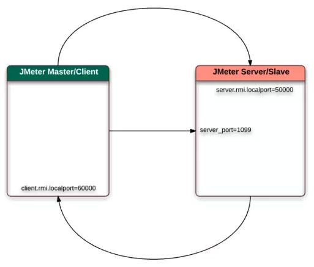
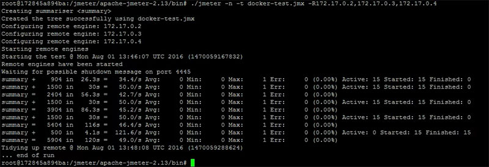
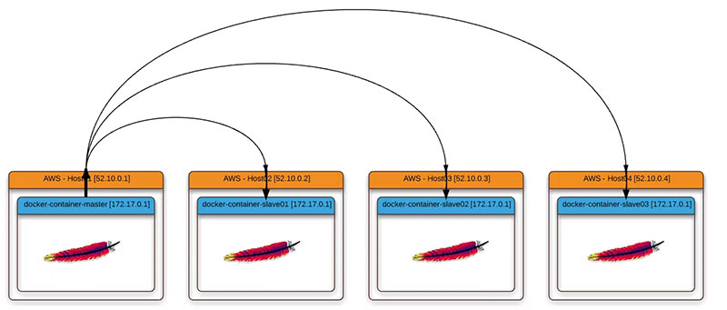

# Basic info
 
 We use Apache JMeter for testing:
 http://jmeter.apache.org
 
 By running multiple instances of JMeter as server in multiple machines we can generate as much load as we need.


## Create testing server

JMeter master and slave communicate as shown in the below picture.



Install ```Ubuntu Server 16.04 LTS``` and open ports **1099**, **50000**, **60000**

SSH into server and run

```bash
sudo apt-get update
sudo apt-key adv --keyserver hkp://p80.pool.sks-keyservers.net:80 --recv-keys 58118E89F3A912897C070ADBF76221572C52609D
sudo apt-add-repository 'deb https://apt.dockerproject.org/repo ubuntu-xenial main'
sudo apt-get update
apt-cache policy docker-engine
sudo apt-get install -y docker-engine
sudo systemctl status docker
```

## Run tests on a one server


#### Launch slaves

```bash
sudo docker run -dit --name slave01 thothbot/jmeter-slave /bin/bash
sudo docker run -dit --name slave02 thothbot/jmeter-slave /bin/bash
sudo docker run -dit --name slave03 thothbot/jmeter-slave /bin/bash
```

#### Launch master
```bash
sudo docker run -dit --name master thothbot/jmeter-master /bin/bash
```

#### See all the running containers and ports opened

```bash
sudo docker ps -a
```


#### Get the list of ip addresses for these containers

```bash
sudo docker inspect --format '{{ .Name }} => {{ .NetworkSettings.IPAddress }}' $(sudo docker ps -a -q)
```


#### Run tests
Copy the test into my JMeter master container:
```bash
sudo docker exec -i master sh -c 'cat > /opt/jmeter/bin/docker-test.jmx' < docker-test.jmx
```
Go inside the container with the below command and we can see if the file has been copied successfully:
```bash
sudo docker exec -it master /bin/bash
```
Lets run the test in master to see if it works fine [not in distributed mode]:
```bash
./jmeter -n -t test.jmx
```


Lets run our test in distributed using docker containers. We just need to append ```-R[slave01,slave02,slave03]```:
```bash
./jmeter -n -t test.jmx -R172.17.0.2,172.17.0.3,172.17.0.4
```



## Run distributes tests



#### Launch slaves
```bash
sudo docker run -dit -e LOCALIP='52.10.0.2' -p 1099:1099 -p 50000:50000 thothbot/jmeter-slave /bin/bash
sudo docker run -dit -e LOCALIP='52.10.0.3' -p 1099:1099 -p 50000:50000 thothbot/jmeter-slave /bin/bash
sudo docker run -dit -e LOCALIP='52.10.0.4' -p 1099:1099 -p 50000:50000 thothbot/jmeter-slave /bin/bash
```

#### Launch master
```bash
sudo docker run -dit --name master -p 60000:60000 thothbot/jmeter-master /bin/bash
```

#### Run tests
```bash
./jmeter -n -t docker-test.jmx -Djava.rmi.server.hostname=52.10.0.1 -Dclient.rmi.localport=60000 -R52.10.0.2,52.10.0.3
```